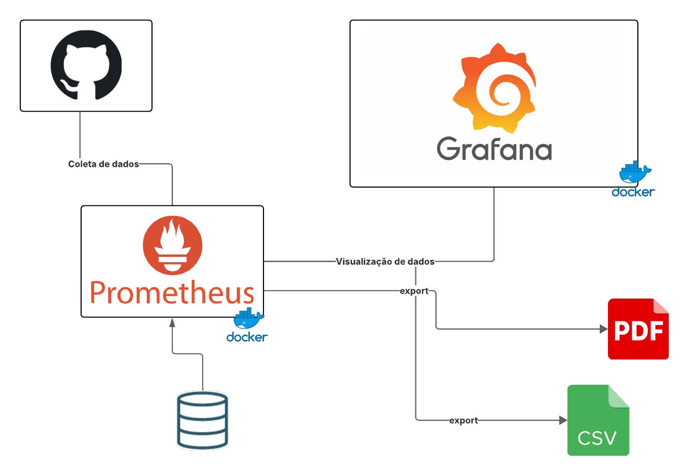

## Descrição do Diagrama de Arquitetura

Este diagrama de arquitetura descreve um sistema de monitoramento para repositórios do GitHub.

### Coleta e Armazenamento de Dados

* **GitHub:** Funciona como a fonte primária de dados. A "Coleta de dados" é realizada a partir daqui.
* **Prometheus:** Atua como o sistema central de monitoramento.
    * Ele recebe os dados coletados do GitHub.
    * Utiliza um banco de dados (representado pelo ícone de cilindro) para armazenar as métricas ao longo do tempo.
    * O Prometheus é indicado como rodando em um ambiente **Docker** (representado pelo logo do Docker).

### Visualização e Exportação

* **Grafana:** É a plataforma de visualização.
    * Recebe os dados do Prometheus ("Visualização de dados") para exibir em dashboards.
    * O Grafana também é indicado como rodando em um ambiente **Docker**.
    * Permite a exportação de dados ou relatórios em formatos **PDF** e **CSV**.

### Fluxo Geral

O fluxo de dados inicia-se no GitHub, de onde as informações são coletadas e enviadas ao Prometheus. O Prometheus armazena essas métricas e as disponibiliza para o Grafana, que as utiliza para criar visualizações. Por fim, o Grafana oferece a funcionalidade de exportar essas visualizações ou os dados brutos em arquivos PDF ou CSV.