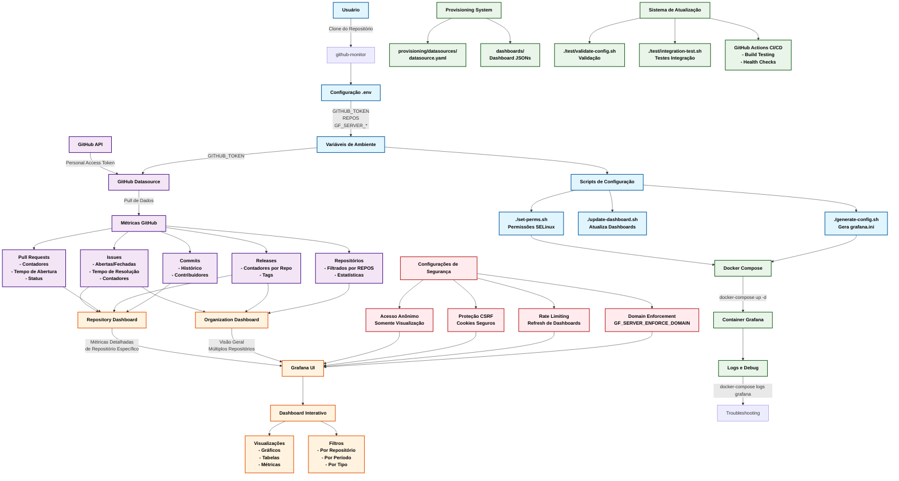

# Fluxograma de Dados

## Descrição dos Componentes

### 🔧 Configuração Inicial (Azul)
- **Clone do Repositório**: Primeira etapa onde o usuário clona o projeto
- **Configuração .env**: Definição das variáveis de ambiente essenciais
- **Scripts de Setup**: Automação da configuração do sistema

### 📊 Fontes de Dados (Roxo)
- **GitHub API**: Fonte primária de dados através de Personal Access Token
- **Métricas Coletadas**:
  - Issues (abertas/fechadas, tempo de resolução)
  - Pull Requests (contadores, tempo de abertura, status)
  - Releases (contadores por repositório, tags)
  - Commits (histórico, contribuidores)
  - Repositórios (estatísticas filtradas)

### ⚙️ Sistema (Verde)
- **Docker Compose**: Orquestração de containers
- **Grafana Container**: Ambiente de execução principal
- **Provisioning System**: Configuração automatizada de datasources e dashboards
- **CI/CD**: Automação de testes e validação

### 🎨 Interface de Usuário (Laranja)
- **Repository Dashboard**: Métricas detalhadas de repositório específico
- **Organization Dashboard**: Visão geral de múltiplos repositórios
- **Grafana UI**: Interface principal com visualizações interativas

### 🔒 Segurança (Vermelho)
- **Acesso Anônimo Controlado**: Visualização sem autenticação com permissões limitadas
- **Proteção CSRF**: Segurança contra ataques cross-site
- **Rate Limiting**: Controle de frequência de atualizações
- **Domain Enforcement**: Restrição de acesso por domínio

## Fluxo de Dados Principal

1. **Inicialização**: Usuário configura variáveis de ambiente e executa scripts de setup
2. **Coleta**: Sistema puxa dados da API do GitHub usando token de acesso
3. **Processamento**: Dados são organizados em métricas específicas
4. **Visualização**: Métricas são apresentadas em dashboards Grafana
5. **Interação**: Usuário acessa dashboards através do navegador

## Variáveis de Ambiente Principais

| Variável | Descrição | Obrigatório |
|----------|-----------|-------------|
| `GITHUB_TOKEN` | Token de acesso pessoal do GitHub | ✅ |
| `REPOS` | Lista de repositórios para monitorar | ❌ |
| `GF_SERVER_ROOT_URL` | URL completa do Grafana | ❌ |
| `GF_SERVER_DOMAIN` | Domínio do servidor Grafana | ❌ |

## Scripts Disponíveis

- `./set-perms.sh`: Configura permissões para ambientes SELinux
- `./generate-config.sh`: Gera arquivo de configuração do Grafana
- `./update-dashboard.sh`: Atualiza configurações dos dashboards
- `./test/validate-config.sh`: Valida configurações
- `./test/integration-test.sh`: Executa testes de integração

## 🕰️ Histórico de Versão
| Data       | Versão | Descrição            | Autores                                                                                                                            |
|------------|--------|----------------------|------------------------------------------------------------------------------------------------------------------------------------|
| 02/06/2025 | 0.1    | Criação do Fluxograma dos Dados | [Yan Luca Viana de Araújo Fontenele](https://github.com/yan-luca) |