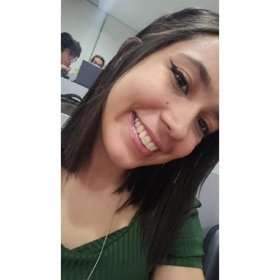
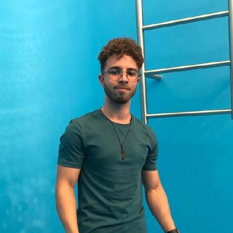
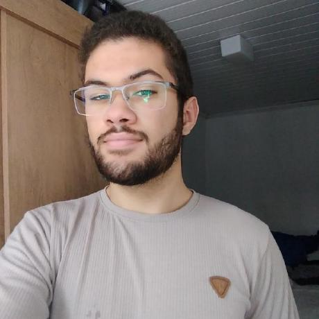

# 📈 Dashboard de Monitoramento de Projetos no GitHub

## 📝 Descrição:
O projeto visa criar um *dashboard em tempo real* para acompanhar repositórios no GitHub, com dados como issues, pull requests, estrelas e contribuidores, atendendo disciplinas da FCTE 

## 🎯 Objetivo:
Selecionar uma solução open source, customizar com a identidade visual da FCTE, e garantir que seja fácil
de implantar via Docker Compose. A solução deve incluir visualização por contribuidor e
exportação de relatórios (PDF/Excel). E subir em ambiente de produção (laboratório).

## 👥 Equipe 
| Nome                                 | Matrícula | Foto                                                                 |
|--------------------------------------|-----------|----------------------------------------------------------------------|
| [Ana Luíza Fernandes Alves da Rocha](https://github.com/analufernanndess) | 211030667 |     |
| [Gabriel Marques de Souza](https://github.com/GabrielMS00)           |           |    |
| [Geovane Freitas](https://github.com/GeovaneSFT)                     |           |   |
| [Renann de Oliveira](https://github.com/renannOgomes)                  |           |  |
| [Tales Rodrigues Gonçalves](https://github.com/TalesRG)          | 211041295 |   |
| [Vitor Borges dos Santos](https://github.com/VitorB2002)             |           |     |

## 🕰️ Histórico de Versão
| Data       | Versão | Descrição            | Autores                                                                                                                            |
|------------|--------|----------------------|------------------------------------------------------------------------------------------------------------------------------------|
| 24/04/2025 | 0.1    | Criação da tela home | [Ana Luíza Fernandes Alves da Rocha](https://github.com/analufernanndess) e [Tales Rodrigues Gonçalves](https://github.com/TalesRG)|
